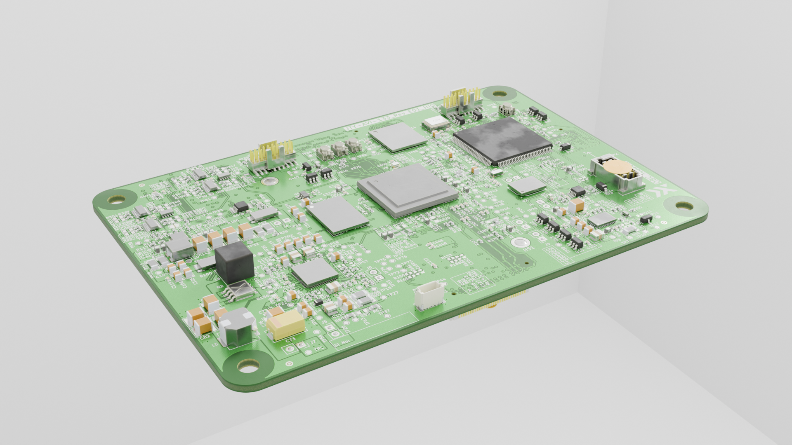

# PCB Name 

> Short summary of what this board does.  
> Example: “On-Board Controller Board for XYZ Mission. Acts as a flight computer for the Satellite Bus”

---

##  Overview

This repository hosts the **KiCAD hardware design**, **simulation data**, **documentation**, and **manufacturing outputs** for the board.  

 
---

## Repository Layout

| Folder / File | Description |
|----------------|-------------|
| [`assets/`](./assets/) | Renders, screenshots, simulation outputs |
| [`docs/`](./docs/) | ICDs, datasheets, bring-up reports |
| [`Subsheets/`](./Subsheets/) | Secondary schematic sheets |
| [`packages3D/`](./packages3D/) | 3D component models |
| [`simulation/`](./simulation/) | Simulation files and results |
| [`archive/`](./archive/) | Older board revisions |
| [`Design-Outputs/`](./Design-Outputs/) | Design-level CI outputs |
| [`Manufacturing-Outputs/`](./Manufacturing-Outputs/) | Manufacturing deliverables |

>  Refer to the [Folder Structure](./docs/FOLDER_STRUCTURE.md) document for detailed explantion. 

---
## Revision History

| Rev | Type | Date | Notes |
|------|------|------|------|
| A.0.0.1 | Prototype | YYYY-MM-DD | Initial release |
| E.0.0.0 | Engineering Model | YYYY-MM-DD | Improved layout |
| F.1.0.0 | Flight Model | YYYY-MM-DD | Final flight version |

> Refer to the [Release Nomenclature]() document for an in-depth explanation of the Release Schemes

---

## Quick Specs

| Parameter | Value |
|------------|--------|
| Board Size | XX mm × YY mm |
| Layers | N Layers |
| Input Voltage | X–Y V |
| Max Current | Z A |
| Processor | STM32H743 |
| Interfaces | CAN, SPI, UART, Ethernet |
| Revision | E.0.0.0 |

---

## Documentation

| Document | Link |
|-----------|------|
| Board Datasheet | [View](./docs/Board_Datasheet.md) |
| Interface Control Document (ICD) | [View](./docs/Interface_Control_Document.md) |
| Bring-up Procedure | [View](./docs/Bringup_Procedure.md) |
| Simulation Report | [View](./docs/Simulation_Report.md) |

---

## Design-Outputs

| File | Description |
|------|-------------|
| [`Design-Outputs/BoardName.pdf`](./Design-Outputs/BoardName.pdf) | Schematic PDF |
| [`Design-Outputs/Layout/BoardName.pdf`](./Design-Outputs/Layout/BoardName.pdf) | PCB Layout |
| [`Design-Outputs/3DModel/BoardName.step`](./Design-Outputs/3DModel/BoardName.step) | 3D Model |
| [`Design-Outputs/BoardName_iBoM.html`](./Design-Outputs/BoardName_iBoM.html) | Interactive BoM |

---

## Manufacturing-Outputs

| File | Description |
|------|-------------|
| [`Manufacturing-Outputs/Gerbers/`](./Manufacturing-Outputs/Gerbers/) | Fabrication files |
| [`Manufacturing-Outputs/BOM/BoardName.csv`](./Manufacturing-Outputs/BOM/BoardName.csv) | Manufacturing BoM |
| [`Manufacturing-Outputs/XY-Data/`](./Manufacturing-Outputs/XY-Data/) | Pick & Place data |

---

## Toolchain

| Tool | Version | Notes |
|------|----------|-------|
| [KiCAD](https://www.kicad.org/) | 9.0.5 | Main design tool |
| GitHub Actions | — | Automates jobset outputs |
| [Interactive BoM Plugin](https://github.com/openscopeproject/InteractiveHtmlBom) | Latest | Manual BoM export |
| [Archive 3D Models Plugin](https://github.com/MitjaNemec/Archive3DModels) | Latest | 3D model archiving |
| [Extract Pins Plugin](https://github.com/wayri/KiWay) | Latest | Helps with ICD Creation. Made by [Yawar](https://github.com/wayri) | 

---

## Contributors

| Name | Role |
|------|------|
| Engineer A | Avionics Engineer |
| Engineer B | EPS Engineer |

---

*Pixxel Electrical and Electronics Engineering Team — Designed with ❤️ and KiCAD.*

